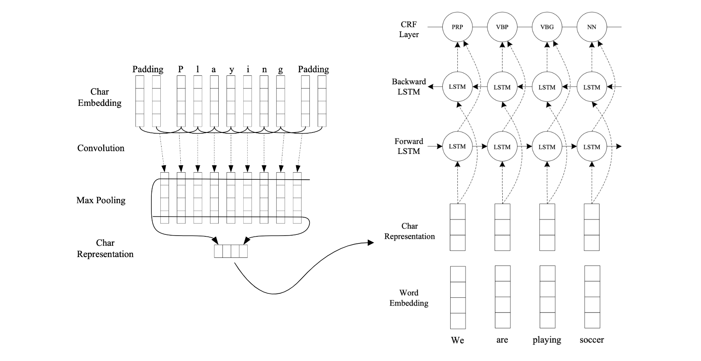

# NER
Sequence tagging task based on [End-to-end Sequence Labeling via Bi-directional LSTM-CNNs-CRF](https://arxiv.org/abs/1603.01354) (ACL 2016) paper .

## Dataset
[Few-NERD](https://arxiv.org/abs/2105.07464) is a large-scale, fine-grained manually annotated named entity recognition dataset, which contains 8 coarse-grained types, 66 fine-grained types, 188,200 sentences, 491,711 entities and 4,601,223 tokens. Three benchmark tasks are built, one is supervised: Few-NERD (SUP) and the other two are few-shot: Few-NERD (INTRA) and Few-NERD (INTER).

## Model
The neural network architecture uses word- and character-level representations. The CNN computes character representations for each word, capturing morphological details. Then character-level representations are concatenated with word embeddings and fed into the BiLSTM layer. In sequence labeling, it is important to have both past and future context. The BiLSTM considers both directions, combining past and future information separately. Finally, the combination of these two hidden states of BiLSTM goes to the CRF layer to decode the best label sequence, considering correlations between labels in neighborhoods.

  

<!-- ## Output
Sentences generated by ChatGPT:

- 
The Mona Lisa,  (art-other) painted by Leonardo da Vinci,  (person-other) is displayed in the Louvre Museum,  (building-other) a renowned cultural institution in Paris. 

- 
The SpaceX Falcon 9 rocket,  (product-other) designed by Elon Musk's aerospace company,  (organization-other) successfully launched a payload into orbit. 

- 
The 2018 Winter Olympic Games  (event-sportsevent) witnessed the triumphs of athletes like Chloe Kim  (person-other) and Johannes Høsflot Klæbo,  (person-other) becoming household names. 

- 
In the Louvre  (building-other) museum, visitors admired the exquisite paintings of Vincent van Gogh  (person-artist/author) while discussing the impact of his work on modern art. 

- 
The Nobel Prize  (other-award) honors remarkable contributions in different fields. Established by Alfred Nobel's  (person-artist/author) will, the prizes are given annually to individuals and organizations that have made outstanding advancements for the benefit of humanity. 

- 
Scientists at NASA  (organization-government/governmentagency) recently discovered a new exoplanet in a distant galaxy, using advanced telescopes and data analysis techniques. 

- 
The FIFA World Cup  (organization-sportsleague) captivated global audiences with thrilling soccer matches. 

- 
The Great Barrier Reef,  (building-other) located off the coast of Australia,  (location-GPE) is a UNESCO World Heritage  (organization-other) site and home to a diverse marine ecosystem. 

- 
The Hubble Space Telescope,  (other-astronomything) a marvel of astronomy technology, captures breathtaking  (other-astronomything) images of distant galaxies and nebulae. 

- 
The European Under-19 Football Championship  (event-sportsevent) featured emerging talents like Luca Hernandez  (person-other) and Sophia Müller,  (person-other) showcasing the future of soccer. 
 -->

## Reference
- [FEW-NERD: A Few-shot Named Entity Recognition Dataset](https://arxiv.org/abs/2105.07464) (ACL-IJCNLP 2021)
- [Conditional Random Fields: Probabilistic Models for Segmenting and Labeling Sequence Data](https://dl.acm.org/doi/10.5555/645530.655813) (ICML 2001)
- [Bidirectional LSTM-CRF Models for Sequence Tagging](https://arxiv.org/abs/1508.01991) (2015)
- [End-to-end Sequence Labeling via Bi-directional LSTM-CNNs-CRF](https://arxiv.org/abs/1603.01354) (ACL 2016)