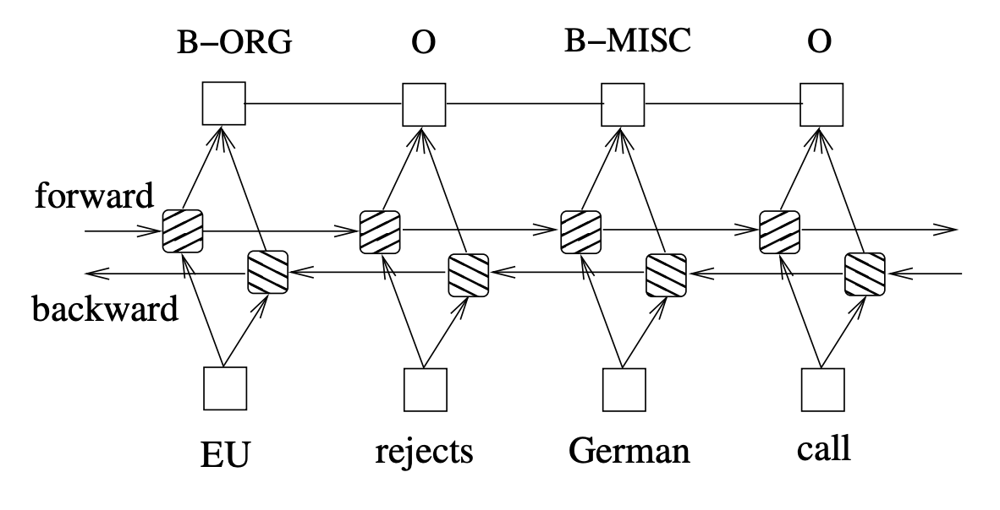

# NER
Sequence tagging task.

## Dataset
[Few-NERD](https://aclanthology.org/2021.acl-long.248.pdf) is a large-scale, fine-grained manually annotated named entity recognition dataset, which contains 8 coarse-grained types, 66 fine-grained types, 188,200 sentences, 491,711 entities and 4,601,223 tokens. Three benchmark tasks are built, one is supervised: Few-NERD (SUP) and the other two are few-shot: Few-NERD (INTRA) and Few-NERD (INTER).

## Models

[Bidirectional LSTM-CRF Models for Sequence Tagging](https://arxiv.org/pdf/1508.01991.pdf)

  

